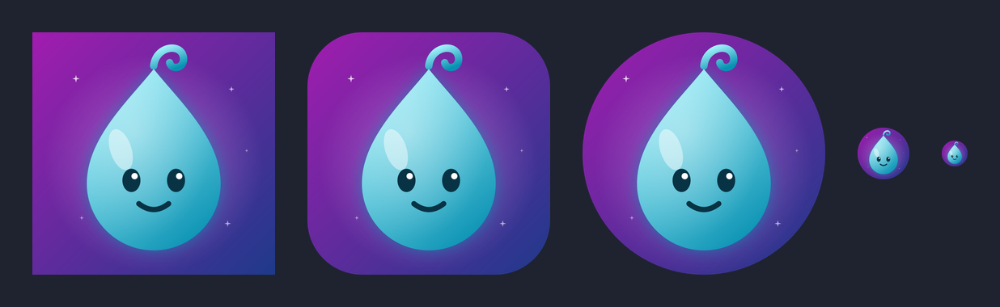

# icons

Avatars and icons for Valley's AI helpers.

## Widget

Staff-facing helper in Google Chat.

| File | Use |
|---|---|
| `widget/widget-1024.png`, `widget/widget-512.png` | Square, for the Google Chat app avatar (Chat crops it to a circle) |
| `widget/widget-circle-1024.png` | Pre-cut circle, transparent corners |
| `widget/widget-rounded-1024.png` | Rounded app-icon tile |
| `widget/widget.svg`, `widget/widget-rounded.svg` | Vector sources |

### Widget, no cheeks

Same design without the rosy cheeks, in `widget/no-cheeks/`.

| File | Use |
|---|---|
| `widget/no-cheeks/widget-1024-no-cheeks.png`, `widget/no-cheeks/widget-512-no-cheeks.png` | Square, for the Google Chat app avatar |
| `widget/no-cheeks/widget-circle-1024-no-cheeks.png` | Pre-cut circle, transparent corners |
| `widget/no-cheeks/widget-rounded-1024-no-cheeks.png` | Rounded app-icon tile |
| `widget/no-cheeks/widget-no-cheeks.svg`, `widget/no-cheeks/widget-rounded-no-cheeks.svg` | Vector sources |
